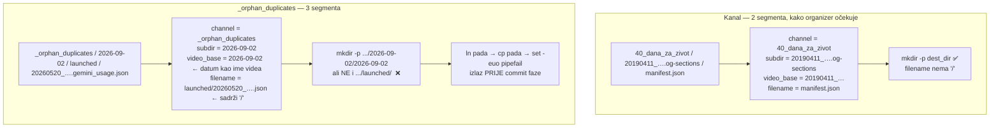

# Sync pada na `_orphan_duplicates` — dubina putanje, ne sadržaj

**Datum:** 2026-09-08
**Repo:** `dataset.domovina.tv`
**Popravak:** commit `adbbfef836`

## Simptom

`./sync_dataset.sh --commit && git push` prekinuo se usred ispisa, s porukom koja
ne spominje ni jednu skriptu:

```
cp: /Users/ms/git/domovinatv/dataset.domovina.tv/data/_orphan_duplicates/2026-09-02/2026-09-02/launched/20260520_92_cascable_studio_daniel_kennett_yt_eab99cbaefd.gemini_usage.json: No such file or directory
```

Posljedica je bila puno gora od jedne preskočene datoteke: **76 videa ostalo je
uncommitano**, a radna kopija prljava. Prva hipoteza — „pada na audio-only
podcastu" — bila je kriva; `launched` u putanji je ime kanala, ne oznaka tipa
medija.

## Uzrok

Organizer (`sync_dataset.sh`, Step 2) pretpostavlja **najviše jednu razinu**
ispod kanala:

```
<channel>/<file>                 → data/<channel>/<video_base>/<file>
<channel>/<subdir>/<file>        → data/<channel>/<video_base>/<subdir>/<file>
```

`_orphan_duplicates/` iz fetch outputa ima **jednu razinu više**, i to s posve
drugom semantikom segmenata:



Dvije neovisne greške u istom retku:

1. **`filename` može sadržavati `/`.** `mkdir -p "$dest_dir"` stvara samo do
   `video_base`, a ne roditelja stvarnog odredišta. Sve dublje od jedne razine
   ruši run.
2. **`set -euo pipefail` pretvara jednu neuspjelu datoteku u totalni gubitak.**
   Commit faza je na kraju skripte, pa svaki raniji `exit` znači da ništa nije
   commitano — a poruka o grešci ni ne nagovijesti da su commitovi izostali.

Duplirani `2026-09-02/2026-09-02` u putanji je najbrži znak prepoznavanja: kad
`video_base` ispadne jednak `subdir`, segment je bio datum ili kanal, ne video.

## Zašto `_orphan_duplicates` uopće postoji

Karantena audita pipelinea od 2026-09-02 — 41 datoteka (351 MB) premještena iz
`storage/output/` da je nijedan skener ne vidi. Puni kontekst:
`fetch.domovina.tv/docs/2026-09-02-audit-nula-rupa.md`, §s osirotjelim duplikatima.

Ključno za ovaj repo: **to nije sadržaj dataseta i ne smije u javni repo.** Isto
vrijedi za `_unlisted`.

## Popravak

1. `mkdir -p "$(dirname "$dest_dir/$filename")"` umjesto `mkdir -p "$dest_dir"`.
   Ovo je pravi popravak — proizvoljna dubina više ne obara run.
2. `SKIP_DIRS=("_unlisted" "_orphan_duplicates")`, korišten na tri mjesta: rsync
   filteri, `storage.conf` petlja (`_unlisted` je ondje bio hardkodiran zasebno),
   i guard u organizeru za ostatke već zapisane u `.sync_staging/`.

Očišćeno: prazan `data/_orphan_duplicates/` i 44 fajla iz staging cachea.

## Provjereno

- `./sync_dataset.sh` prolazi čisto: 74693 fajla, 6189 videa, 49 kanala.
- `--commit` je zatim odradio 76 zaglavljenih videa (sve `og-sections/manifest.json`
  s promijenjenim `generated_at`), push `39fb75d012..ed496ac30a`.

## Otvoreno

- **Novi audit može stvoriti novi `_*` direktorij**, a ništa u pipelineu to ne
  javlja dataset strani. Popravak #1 sprječava rušenje, ali takav direktorij bi se
  tiho **sinkao u repo** dok se ne doda u `SKIP_DIRS`. Alternativa koja nije
  napravljena: preskočiti *svaki* top-level `_*` direktorij umjesto imenovane
  liste — odbačeno jer bi tiho progutalo i legitiman kanal koji bi ikad počeo
  podvlakom, a lista je kratka i eksplicitna.
- R2 ključevi osirotjelih duplikata (`data/<synth>/`) i dalje stoje — to je
  stavka fetch repoa, ne ovog.
